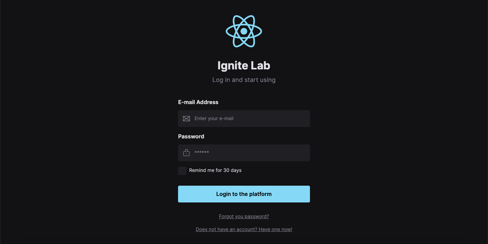
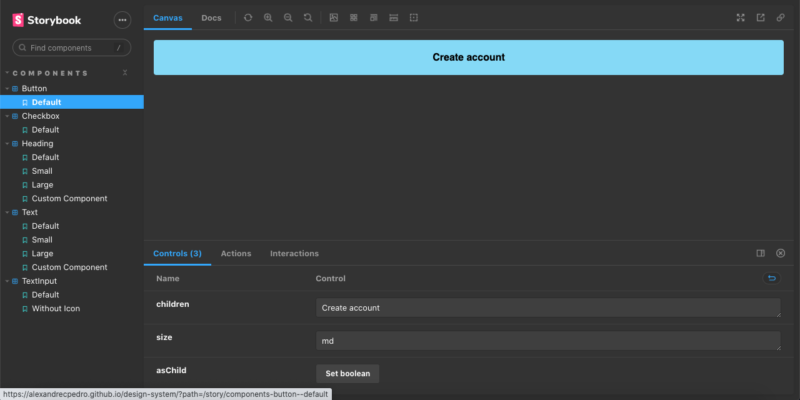

  <h1> Design System </h1>

 

  

 

  

 
 

 <a href="#theproject">The Project</a> •
 <a href="#target">Target</a> •
 <a href="#technologies">Technologies</a> •
 <a href="#route">Route</a> •
 <a href="#howtouse">How to Use</a>

 

<h2> 📓 The Project </h2>

 Design System 

<h2> 💡 Target </h2>
Development of an Design System at Ignite Lab, from Rocketseat

 

<h2> 🛠 Technologies </h2>
The following tools were used in building the project:  

|                      Type                       |           Tools           |            References             |
| :---------------------------------------------: | :-----------------------: | :-------------------------------: |
|                       IDE                       |          VS CODE          |  https://code.visualstudio.com/    |
|              Design Interface Tool              | FIGMA (Prototype - UX/UI) |      https://www.figma.com/                 |
|              Programming Language               |           REACT           |       https://reactjs.org/                 |
|              Programming Language               |        TYPESCRIPT         |  https://www.typescriptlang.org/  |
|           Utility-first CSS Framework            |       TAILWIND CSS        |     https://tailwindcss.com/                 |
|    Tool for transforming CSS with JavaScript    |         POST CSS          |       https://postcss.org/                 |
|               Graphic components                |      PHOSPHOR ICONS       |    https://phosphoricons.com/                 |
|     UI Isolated Component Building Library      |         STORYBOOK         |     https://storybook.js.org/                 |
|             UI Components for React             |         RADIX-UI          |     https://www.radix-ui.com/                 |
|          Tool to build frontend faster          |          VITE.JS          |        https://vitejs.dev/                 |
| Seamless API mocking library for browser and Node  |        MSW.JS          |        https://mswjs.io/                  |

 

  <h3>Backend</h3>
  
   
  <h3>IDE</h3>
  
   
  <h3>UX/UI</h3>
  
  
  
   
  
   
  <h3>Frontend</h3>
  
  
  
   
  
   

<h2> 🔎 Route </h2>
  <ol>
    <li &nbsp;>Part 1 - Design System's visual structure 
      <ul &nbsp;>
        <li &nbsp;>Design Systems
          <ul>
            <li>Convention created within companies and related to a similar visual structure that is applied across multiple projects</li>
          </ul>
        </li>
        <li &nbsp;>Build the project prototype (Figma):
          <ul>
            <li><b>Creating login form</b>
              <ul>
                <li>E-mail</li>
                <li>Password</li>
                <li>Remind me</li>
                <li>Login</li>
              </ul>
            </li>
            <li><b>Creating tokens with Figma</b></li>
            <li><b>Components</b>
              <ul>
                <li>Text</li>
                <li>Heading</li>
                <li>TextInput</li>
                <li>Button</li>
                <li>Checkbox</li>
              </ul>
            </li>
          </ul>
        </li>
      </ul>
    </li>
     
    <li &nbsp;>Part 2 - From Figma to React, creating application 
      <ul &nbsp;>
        <li &nbsp;>Creating React project: npm create vite@latest</li>
        <li &nbsp;>Install de dependencies from package.json: npm i</li>
        <li &nbsp;><b>Setting Tailwind CSS</b>
          <ul>
            <li>Install Tailwind CSS, PostCSS and autoprefixer: npm i tailwindcss postcss autoprefixer -D</li>
            <li>Start Tailwind CSS: npx tailwindcss init -p</li>
            <li>Customize contents, themes, fonts and plugins with Tailwind: ./tailwind.config.cjs</li>
            <li>Install VS Code extensions: Tailwind CSS IntelliSense, PostCSS Language Support, MDX</li>
            <li>Customize the global style: ./src/styles/global.css</li>
            <li>Customize classes at Tailwind: npm i clsx</li>
          </ul>
        </li>
        <li &nbsp;>Importing font: ./index.html</li>
        <li &nbsp;>Importing tokens: ./tailwind.config.cjs</li>
        <li &nbsp;><b>Storybook</b>
          <ul>
            <li>Setup: npx sb init --builder @storybook/builder-vite --use-npm</li>
            <li>Run: npm run storybook</li>
          </ul>
        </li>
        <li &nbsp;><b>Component</b>
          <ul>
            <li><em>Text</em>
              <ul>
                <li>React Component: ./src/components/text/Text.tsx</li>
                <li>Storybook: ./src/components/text/Text.stories.tsx</li>
                <li>Create feature (slot)
                  <ul>
                    <li>Install Radix-UI: npm i @radix-ui/react-slot</li>
                  </ul>
                </li>
              </ul>
            </li>
            <li><em>Heading</em>
              <ul>
                <li>React Component: ./src/components/heading/Heading.tsx</li>
                <li>Storybook: ./src/components/heading/Heading.stories.tsx</li>
              </ul>
            </li>
            <li><em>Button</em>
              <ul>
                <li>React Component: ./src/components/button/Button.tsx</li>
                <li>Storybook: ./src/components/button/Button.stories.tsx</li>
              </ul>
            </li>
            <li><em>Checkbox</em>
              <ul>
                <li>React Component: ./src/components/checkbox/Checkbox.tsx</li>
                <li>Storybook: ./src/components/checkbox/Checkbox.stories.tsx</li>
                <li>Create feature (checkbox)
                  <ul>
                    <li>Install Radix-UI: npm i @radix-ui/react-checkbox</li>
                  </ul>
                </li>
              </ul>
            </li>
            <li><em>TextInput</em>
              <ul>
                <li>React Component: ./src/components/textInput/TextInput.tsx</li>
                <li>Storybook: ./src/components/textInput/TextInput.stories.tsx</li>
                <li>Install Phosphor Icons: npm i phosphor-react</li>
              </ul>
            </li>
          </ul>
        </li>
        <li &nbsp;> Setting Arg Types for each component</li>
        <li &nbsp;> To run project: npm run dev</li>
      </ul>
     
    <li &nbsp;>Part 3 - Testing and automating 
      <ul &nbsp;>
        <li &nbsp;><b>Publish documentation</b>
          <ul>
            <li>Storybook deployer: npm i @storybook/storybook-deployer --save-dev</li>
            <li>Add a NPM script
              <ul>
                <li><em>For GitHub Pages</em> 
                  <pre><code>
                  {
                    "scripts": {
                      "deploy-storybook": "storybook-to-ghpages"
                    }
                  }
                  </code></pre>
                </li>
                <li><em>For AWS S3</em> 
                  <pre><code>
                  {
                    "scripts": {
                      "deploy-storybook": "storybook-to-aws-s3"
                    }
                  }
                  </code></pre>
                </li>
              <ul>
            </li>
            <li>Build Storybook script: npm run build-storybook</li>
            <li>Add storybook-static folder to .gitignore</li>
            <li><em>Upload project to GitHub</em>
              <ul>
                <li>New repository
                  <ol>
                    <li>Create: gh repo create</li>
                    <li>Choose "Push an existing local repository to GitHub"</li>
                    <li>Enter a path to local repository</li>
                    <li>Enter a repository name</li>
                    <li>Enter a description</li>
                    <li>Choose visibility (public, private or internal)</li>
                    <li>Add a remote? Y</li>
                    <li>What should the new remote be called? (origin)</li>
                  </ol>
                </li>
                <li>Add: git add .</li>
                <li>Commit: git commit -m "myProject"</li>
                <li>Branch: git branch -M branch_name</li>
                <li>Push: git push origin branch_name</li>
              </ul>
            </li>
          </ul>
        </li>
        <li &nbsp;>Storybook CI/CD (continuous integration)
          <ul>
            <li>New file: .github/workflows/deploy-docs.yml</li>
            <li>Settings based on GitHub Actions</li>
            <li>Add the following code at .storybook/main.cjs
              <pre><code>
              module.exports = {
                ...,
                viteFinal: (config, { configType }) => {
                  if (configType === 'PRODUCTION') {
                    config.base = '/design-system/'
                  }
                  return config
                }
              }
              </code></pre>
            </li>
            <li>Add force to npm ci script: .github/workflows/deploy-docs.yml</li>
          </ul>
        </li>
        <li &nbsp;><b>Creating interface with components: ./src/App.tsx</b>
          <ul>
            <li>Transform React logo SVG to a JSX: https://transform.tools</li>
            <li>Create Logo element: ./src/Logo.tsx</li>
            <li>Add phosphor icons/li>
            <li>Customize contents, themes, fonts, forms and plugins</li>
          </ul>
        </li>
        <li &nbsp;><b>Accessibility addon</b>
          <ul>
            <li>Install: npm install @storybook/addon-a11y</li>
            <li>Settings based on GitHub Actions</li>
            <li>Add the following code at .storybook/main.cjs
              <pre><code>
              module.exports = {
                addons: [
                  ...,
                  '@storybook/addon-a11y'
                ],
                ...
              };
              </code></pre>
            </li>
          </ul>
        </li>
        <li &nbsp;><b>Storybook</b>
          <ul>
            <li>Setup: npx sb init --builder @storybook/builder-vite --use-npm</li>
            <li>Run: npm run storybook</li>
          </ul>
        </li>
      </ul>
    </li>
    <li &nbsp;>Part 4 - Automated Tests and API mock 
      <ul &nbsp;>
        <li &nbsp;><b>SignIn page</b>
          <ul>
            <li>Create a page: ./src/pages/SignIn.tsx</li>
            <li>Set function to simulate login</li>
          </ul>
        </li>
        <li &nbsp;><b>Tests for SignIn stories</b> 
          <ul>
            <li>Storybook for SignIn page: ./src/pages/SignIn.stories.tsx</li>
            <li><em>Interactions Addon</em>
              <ul>
                <li>Install dependency
                  <pre><code>
                  npm install @storybook/addon-interactions @storybook/jest 
                  @storybook/testing-library @storybook/test-runner -D
                  </code></pre>
                </li>
                <li>Add the following code at .storybook/main.cjs
                  <pre><code>
                  module.exports = {
                    addons: [
                      ...,
                      '@storybook/addon-interactions'
                    ],
                    ...,
                    features: {
                      ...,
                      interactionsDebugger: true,
                    },
                    ...
                  };
                  </code></pre>
                </li>
              </ul>
            </li>
            <li>Setting automated tests on StoryObj: function play()</li>
          </ul>
        </li>
        <li &nbsp;><b>API with Axios</b>
          <ul>
            <li>Install Axios: npm i axios</li>
            <li>Use on SignIn page: ./src/pages/SignIn.tsx</li>
          </ul>
        </li>
        <li &nbsp;><b>MSW (Mock Service Worker) addon</b>
          <ul>
            <li>Install: npm install msw msw-storybook-addon -D</li>
            <li><em>Generate service worker for MSW in your public folder</em>
              <pre><code>
              npx msw init public/
              Do you wish to save "public" as the worker directory? (Y/n) Y
              </code></pre>
            </li>
            <li>Add the following code at .storybook/main.cjs
              <pre><code>
              module.exports = {
                ...,
                "staticDirs": [
                  "../public"
                ],
                ...
              };
              </code></pre>
            </li>
            <li>Initialize MSW and provide the MSW addon decorator globally: .storybook/preview.cjs
              <pre><code>
              import { initialize, mswDecorator } from 'msw-storybook-addon';
              // Initialize MSW
              initialize({
                onUnhandledRequest: 'bypass'
              });
              // Provide the MSW addon decorator globally
              export const decorators = [mswDecorator];
              </code></pre>
            </li>
            <li>Add the following code at ./src/pages/SignIn.stories.tsx
              <pre><code>
              export default {
                ...,
                parameters: {
                  msw: {
                    handlers: [
                      rest.post('/sessions', (req, res, ctx) => {
                        return res(ctx.json({
                          message: 'Successfully logged in!'
                        }))
                      })
                    ],
                  },
                }
              } as Meta
              </code></pre>
            </li>
          </ul>
        </li>
      </ul>
    </li>
     
  </ol>

 

<h2>🧪 How to use</h2>
  <ol &nbsp;>
    <li &nbsp;>Set the development environment at you local computer</li>
    <li &nbsp;>Clone the repository
      <ul>
        <li>git clone https://github.com/alexandrecpedro/design-system</li>
      </ul>
    </li>
    <li &nbsp;>Enter the project directory:
      <ul>
        <li>cd design-system</li>
      </ul>
    </li>
    <li &nbsp;>Install the dependencies
      <ul>
        <li>npm install</li>
      </ul>
    </li>
    <li &nbsp;>Run Project
      <ul>
        <li>npm run dev</li>
      </ul>
    </li>
    <li &nbsp;>Storybook
      <ul>
        <li>Setup: npx sb init --builder @storybook/builder-vite --use-npm</li>
        <li>Run: npm run storybook</li>
      </ul>
    </li>
    <li &nbsp;>Run automated tests
      <ul>
        <li>Run: npm run test-storybook</li>
      </ul>
    </li>
  </ol>

